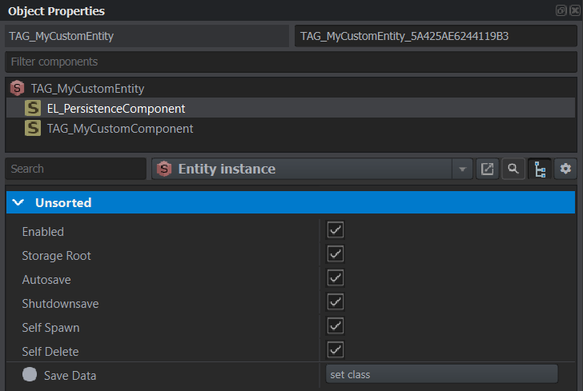
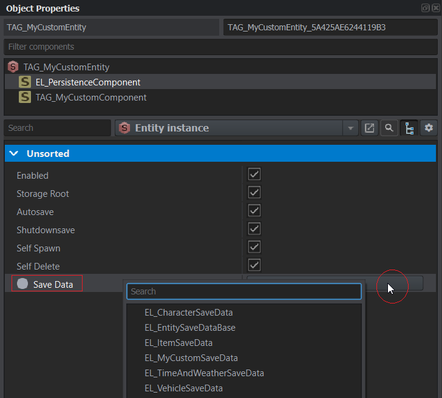
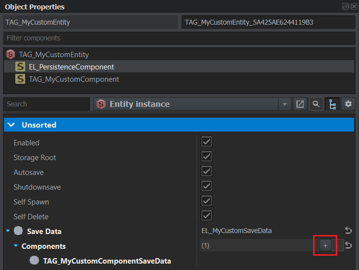

# Persistence
The persistence framework is built on top of the [database framework](../database/index.md) and handles the saving and loading of all relevant gameplay elements across sessions.
`Ground items`, `items inside items` (with no restrictions on how nested the storage hierarchy can be), `vehicles`, and `characters` are persisted with all their relevant component information. Additionally, in-game date, `time`, and `weather` as well
as the current state of the `garbage manager` (if present) are saved. In addition to these `IEntity` based instances, the framework also persists arbitrary scripted states that inherit from `Class`/`Managed`.

The general idea of the system is to extract all the relevant information that is required to achieve the same state again. 
Bohemia's built-in save game feature achieves this by dumping *everything* about an entity, including all the information that is hard configured in the prefabs anyway.
This approach is too wasteful for keeping track of a large number of entities and is not as flexible when it comes to migrations required by this game mode.
This custom persistence framework instead only targets specific properties on the entity or its components and has support for versioning. 
When loading back an entity by prefab only the previously extracted information is applied to it again, returning it to its "original" state.

> **Note**
> This feature is still experimental. While backward compatibility will be added for any change that allows it, save-data might become incompatible on major updates leading up to the 1.0 release of the framework.
> After version 1.0 any update will have a guarantee to be backward compatible.

## Persistence manager
The persistence is managed through the [`EL_PersistenceManager`](https://wb.reforger.dev/redirect?to=enfusion://ScriptEditor/Scripts/Game/Core/Persistence/EL_PersistenceManager.c) that is connected to the gamemode via the [`EL_PersistenceManagerComponent`](https://wb.reforger.dev/redirect?to=enfusion://ScriptEditor/Scripts/Game/Core/Persistence/EL_PersistenceManagerComponent.c) on it.
All save and load operations go through this manager. It keeps track of all entities that are part of the persistence system and offers "auto-save" functionality. Besides the "auto-save", it also saves the world state on server shutdown.

Some central settings like if "auto-save" is enabled, the interval for it as well as the overall update rate can be configured through the `EL_PersistenceManagerComponent` attributes.
The `EL_PersistenceManagerComponent` is already added to the [`GameMode_Roleplay.et`](https://wb.reforger.dev/redirect?to=enfusion://ResourceManager/~EveronLife:Prefabs/MP/Modes/Roleplay/GameMode_Roleplay.et) base prefab which all derived mods should use.

## World entities
To connect an `IEntity` to the persistence manager the [`EL_PersistenceComponent`](https://wb.reforger.dev/redirect?to=enfusion://ScriptEditor/Scripts/Game/Core/Persistence/EL_PersistenceComponent.c) is used. 
Only world entities with the component present and enabled will be persisted. By default, all relevant base prefabs for characters, their equipment, items, and vehicles already have the component.
You can selectively *disable* persistence as well. A "special" entity/prefab can be exempt from being persisted inside an inventory or on the ground by unchecking the `Enabled` attribute on the `EL_PersistenceComponent`.
This will also cancel the loading of an entity/prefab if it was previously saved, but after a mod-update should no longer be part of persistence.  
For more information on the available script API to interact with the `EL_PersistenceComponent` please refer to its inline documentation.

### Minimal world entity setup
To demonstrate how the works the following example will add a new entity class `TAG_MyCustomEntity` and a component containing custom data `TAG_MyCustomComponent`.
```cs
class TAG_MyCustomEntityClass : GenericEntityClass {}
class TAG_MyCustomEntity : GenericEntity {}
class TAG_MyCustomComponentClass : ScriptComponentClass {}
class TAG_MyCustomComponent : ScriptComponent
{
	int m_iNumber = 1337;
}
```
#### Step 1: Entity save-data
To persist this entity type a custom save-data class `EL_MyCustomSaveData` is introduced.
```cs
[EL_DbName(EL_MyCustomSaveData, "MyCustomEntity"), BaseContainerProps()]
class EL_MyCustomSaveData : EL_EntitySaveDataBase
{
}
```
It inherits from the required base class for all entities `EL_EntitySaveDataBase` that contains the base logic for extracting the persistent id, prefab, and all the components that need to be saved.
The `EL_DbName` is used to give this type of entity its own representation in the underlying database e.g. its own table. For details on this see the [Creating your own database entity](../database/index.md#creating-your-own-database-entity).
Additionally, the `BaseContainerProps` attribute is added to make the class selectable in the workbench.

#### Step 2: Component save-data
To persist information from the custom component it needs its own save-data as well.
```cs
[EL_ComponentSaveDataType(TAG_MyCustomComponentSaveData, TAG_MyCustomComponent, "MyCustomComponent"), BaseContainerProps()]
class TAG_MyCustomComponentSaveData : EL_ComponentSaveDataBase
{
	int m_iNumber;

	//------------------------------------------------------------------------------------------------
	override bool ReadFrom(notnull GenericComponent worldEntityComponent)
	{
		TAG_MyCustomComponent myCustomComponent = TAG_MyCustomComponent.Cast(worldEntityComponent);
		m_iNumber = myCustomComponent.m_iNumber;
		return true;
	}

	//------------------------------------------------------------------------------------------------
	override bool ApplyTo(notnull GenericComponent worldEntityComponent)
	{
		TAG_MyCustomComponent myCustomComponent = TAG_MyCustomComponent.Cast(worldEntityComponent);
		myCustomComponent.m_iNumber = m_iNumber;
		return true;
	}
}
```
The class contains a member `m_iNumber` to save the information. It also has the methods `ReadFrom` to extract the save-data from the real component instance as well as `ApplyTo` to apply the saved information back to the component instance on loading.
Using the `EL_ComponentSaveDataType` attribute the save-data is associated with which type of component it handles, in this case, `TAG_MyCustomComponentSaveData` handles `TAG_MyCustomComponent`. 
The `"MyCustomComponent"` argument following that is a shortcut to the `EL_DbName` attribute previously mentioned. `BaseContainerProps` again make this class selectable in the workbench.

##### Multiple component instances
It is possible to have multiple instances of a component type on an entity e.g. `StorageComponent`. To select which instance gets which save-data applied the `EL_ComponentSaveDataBase::IsFor()` method can be implemented.
It is called for each of the component instances to find the matching one. A use case example of this can be found [here](https://wb.reforger.dev/redirect?to=enfusion://ScriptEditor/Scripts/Game/Core/Persistence/Components/EL_BaseInventoryStorageComponentSaveData.c;42).

##### Load order requirements
Sometimes one component requires that other components are already loaded to function correctly. To control the order in which save-data is applied the method `EL_ComponentSaveDataBase::Requires()` can be implemented.
```cs
class TAG_MyCustomComponentSaveDataWithDependency : EL_ComponentSaveDataBase
{
	...
	override array<typename> Requires()
	{
		return {TAG_OtherComponentSaveDataType};
	}
}
```

#### Step 3: World entitor setup
After opening an instance of `TAG_MyCustomEntity` in the world editor and adding the custom component `TAG_MyCustomComponent` to it the `EL_PersistenceComponent` component must be added.  
More information on what the attributes on it do can be found by hovering over their names.  


Initially, no save-data is configured. To change that select a save-data class as shown below. For this example, `EL_MyCustomSaveData` is chosen.  


Then the individual save-data classes for the components that should be persisted are added to the list as follows.  


#### Step 4: Profit!
When the entity is saved a record for it in the database will be created. In this example, the JSON file driver was used.
`.db\EveronLife\MyCustomEntities\5a42614a-0000-0001-0000-0022225644c0.json`
```json
{
	"m_iDataLayoutVersion": 1,
	"m_sId": "5a42614a-0000-0001-0000-0022225644c0",
	"m_iLastSaved": 1514300206,
	"m_rPrefab": "838C69FCD08BDBD1",
	"m_aComponents": [
		{
			"dataType": "MyCustomComponent",
			"m_pData": {
				"m_iDataLayoutVersion": 1,
				"m_iNumber": 1337
			}
		}
	]
}
```

### Loading world entities
Entities that were spawned into the world and have `Self Spawn` enabled in their `EL_PersistenceComponent` attributes will automatically be spawned back right after the world initialization.
To quickly spawn and load a world entity manually from the persistence system the [`EL_PersistentWorldEntityLoader`](https://wb.reforger.dev/redirect?to=enfusion://ScriptEditor/Scripts/Game/Core/Persistence/EL_PersistentWorldEntityLoader.c;23) utlity class can be used. It offers functions for sync and asnyc loading by *prefab + id* or *save-data type + id*.  
If the save-data was retrieved through different means it can be spawned by calling the `EL_EntitySaveDataBase::Spawn()` method. Avoid manually spawning the prefab and then applying data to it, as this can cause a temporary miss-match of the persistent id on the entity.

## Scripted states
Besides persisting entities, it is also possible to save and load scripted states. The example below shows the minimal setup required. 
For more information on the available script API for them please refer to the inline documentation inside [`EL_PersistentScriptedStateBase`](https://wb.reforger.dev/redirect?to=enfusion://ScriptEditor/Scripts/Game/Core/Persistence/EL_PersistentScriptedStateBase.c).
```
[EL_PersistentScriptedStateSettings(TAG_MyLogic, TAG_MyLogicSaveData, autoSave: true, shutDownSave: true, selfDelete: false)]
class TAG_MyLogic : EL_PersistentScriptedStateBase
{
	ref array<string> m_aNames;
}

[EL_DbName(TAG_MyLogicSaveData, "MyLogic")]
class TAG_MyLogicSaveData : EL_ScriptedStateSaveDataBase
{
	ref array<string> m_aNames;
}
```
The [`EL_PersistentScriptedStateSettings`](https://wb.reforger.dev/redirect?to=enfusion://ScriptEditor/Scripts/Game/Core/Persistence/EL_PersistentScriptedStateBase.c;178) associates a save-data type with the scripted state as well as configures the options normally found on the persistence component.
Inherited states must register an inherited save-data type even if the data to be persisted is the same for both.

### Loading scripted states
Scripted states are not automatically loaded back on world init. To instantiate them use the [`EL_PersistentScriptedStateLoader<T>`](https://wb.reforger.dev/redirect?to=enfusion://ScriptEditor/Scripts/Game/Core/Persistence/EL_PersistentScriptedStateLoader.c) utility class.  
If the save-data of a scripted state was retrieved manually it can be spawned by calling `EL_ScriptedStateSaveDataBase::Spawn()`.

## Serialization support
Depending on the complexity of the data structures used and the design of the `ReadFrom` and `ApplyTo` methods it might be useful or even required to override the serialization behavior of save-data classes. 
More information on how this can be achieved can be found [here](https://community.bistudio.com/wiki/Arma_Reforger:Serialisation#Advanced).
During DB operations most drivers will serialize/deserialize the data at least once. To support something like a `map<K, V>` as a save-data member variable, it needs to be translated into an array first. 
An example of this can be found [here](https://wb.reforger.dev/redirect?to=enfusion://ScriptEditor/Scripts/Game/Core/Persistence/EL_EntitySaveDataBase.c;170).
Another example where it might be needed is if polymorphic types are used in the save-data as seen [here](https://wb.reforger.dev/redirect?to=enfusion://ScriptEditor/Scripts/Game/Core/Persistence/EL_EntitySaveDataBase.c;231).

## Automatic data mapping
When dealing with save-data that is a subset of the original entity/component/state in terms of member variable types and names, the utility function `EL_DbEntityUtils.StructAutoCopy()` can be used to make a deep auto copy of all matching properties. 
This can be used both during `ReadFrom` and on the way back inside `ApplyTo`. It also has the ability to get and set otherwise private or protected members. Because it uses JSON serialization internally, any behavior defined using `[NonSerialized]` or `SerializationSave`/`SerializationLoad` overrides will be taken into account.
Double-check results when using it because depending on inheritance, it might override data prepared by a base class.  
It is the default implementation of any `EL_ComponentSaveDataBase`. So for simple data transfer derived component save-data classes do not *need* to implement `ReadFrom` or `ApplyTo`.

## Baked map entities
World entities are considered "baked" if they are placed on the map in the world editor. The persistence system supports saving and loading them. 
For this to be possible they are identified by their name inside the world. 
All entities with an active persistence component will generate and set a name like `ArmyCrackers_Soviet_01_5A12DE84BB44EF42` when a world is opened. 
These names can be changed to something more recognizable by the user, but if data was previously saved under a different name, renaming a baked entity will destroy its connection.
To fix this a manual edit of the `BakedEntityNameIdMapping` stored in the DB will be required. It is generally advised to carefully choose a name in advance.
Because of the identification by name, baked entities can be moved and their prefab can be changed - the save-data will continue to be applied.
The system also supports "deleting" baked entities. If for example an inventory item was put onto the map and was taken by a character, it will not spawn back unless the character that took it removes it from their inventory again.

> **Note**
> Currently there is no support for persisting information of baked objects of parent scenes, as the sub-scene is unable to assign them names. Support for this is already designed and will be added later.

## Persistence DB context/repository
> **Note**
> Before trying to access the persistence DB directly, double-check that there is no other intended way to handle the task at hand.
> Normally all features can be designed through the use of the existing `EL_PersistenceComponent` and `EL_PersistentScriptedStateBase`.

To use the same `EL_DbContext` as the persistence system, any custom logic can access it through `EL_PersistenceManager::GetDbContext()`.
There are also utility classes to get an `EL_DbRepository<T>` that is already connected to the persistence DB context:
- [`EL_PersistenceEntityHelper<TEntityType>`](https://wb.reforger.dev/redirect?to=enfusion://ScriptEditor/Scripts/Game/Core/Persistence/EL_PersistenceRepository.c)
- [`EL_PersistenceRepositoryHelper<TRepositoryType>`](https://wb.reforger.dev/redirect?to=enfusion://ScriptEditor/Scripts/Game/Core/Persistence/EL_PersistenceRepository.c;22)
