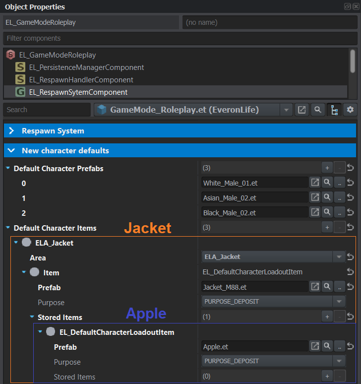

# New character defaults
The configuration of the visual appearance and what items a new character spawns with can be found on the `EL_GameModeRoleplay` entity/prefab inside the `EL_RespawnSytemComponent`.

## Default character prefabs
One or more preset prefabs can be added to the array. As of right now, one preset is selected at random for the visual appearance of the character

## Default character items
The items added to each new character can be configured as an array of equipment slots. Each slot is assigned to a loadout area and has one item.  
Each item can then also store items inside them, like a jacket storing an apple as the following example shows:  

