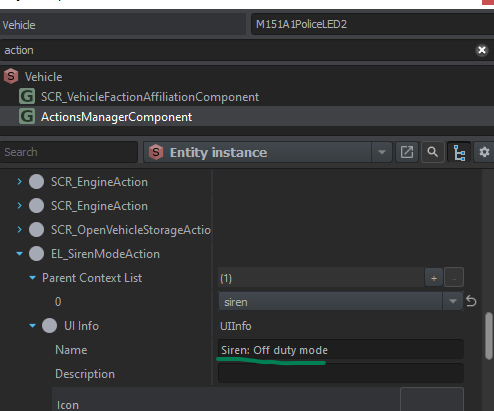
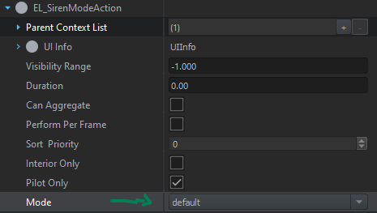

# Advanced usage

The system introduces 3 components:

- ```EL_SirenManagerComponent``` located in the vehicle
- ```EL_LightComponent``` located in the emissive surface
- ```EL_SirenKnobComponent``` located in the knob that controls the siren

It also introduces the action ```EL_SirenModeAction``` that allows the player to change the siren modes.

## Contents

- [Advanced usage](#advanced-usage)
  - [Contents](#contents)
  - [Changing modes display names](#changing-modes-display-names)
  - [Changing action options](#changing-action-options)
  - [Configuring each mode](#configuring-each-mode)
    - [Animation](#animation)
      - [`EL_LoopEntry`](#el_loopentry)
      - [`EL_LightEntry`](#el_lightentry)
      - [`EL_AnimationEntry`](#el_animationentry)

## Changing modes display names

Selecting the vehicle you wish to change, go to its `ActionsManagerComponent` and find the action `EL_SirenModeAction`. Under the action you can change the `UIInfo`'s name as shown below.


## Changing action options

In the same place, you have more options. You can make the action available to everyone, not just the driver and you can change which mode is selected by the action as shown below.


## Configuring each mode

The configuration of the modes is done in the `EL_SirenManagerComponent` located in the vehicle. There, you can create modes as desired. You can also change the already available config files located in `Configs/Vehicles/Siren/` There are currently 8 different configurable modes. `default` mode is the mode the vehicle will be on spawn. You can:

- Customize the light animation that is played
- Choose the sounds of the siren from a list
- Change the knob position (only useful if using a custom knob)

### Animation

Each animation is composed of `entries`. Each entry can change the flow of the animation and affect lights in some way. The animation plays until it executes all entries and then stops. You can loop the animation by using an `EL_LoopEntry`.

#### `EL_LoopEntry`

Used to loop the animation. You can loop the animation from the beggining or a specific number of entries. You can also loop a specific number of times or infinitely. You must use this at the end of the animation if you want it to loop.

#### `EL_LightEntry`

Used to affect the lights. Can be turned on, off or toggled. Lights can be changed individually, using the name set in its `EL_LightComponent`. Typing `left1 left3` in the `name` field means "affect all lights that contain `left1` in their name and all the lights that contain `left3` in their name".

#### `EL_AnimationEntry`

Same as `EL_LightEntry` but affects the animation of the entity, usually spinning.
