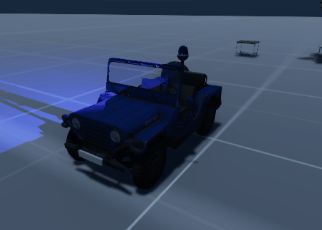
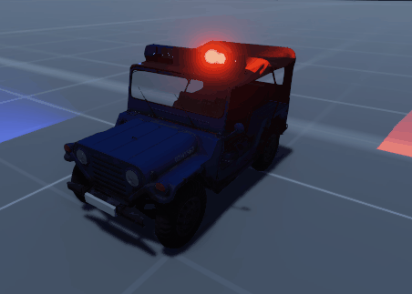
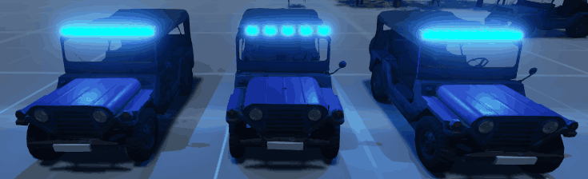
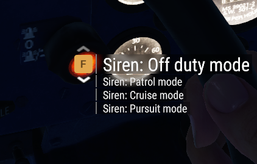

# Basic usage

- [Basic usage](#basic-usage)
  - [How does it work?](#how-does-it-work)
  - [How do I use it?](#how-do-i-use-it)
    - [Available vehicles](#available-vehicles)
      - [M151A2 with rotary light pole](#m151a2-with-rotary-light-pole)
      - [M151A2 with rotary light bar](#m151a2-with-rotary-light-bar)
      - [M151A2 with LED light bar](#m151a2-with-led-light-bar)
    - [Available Modes](#available-modes)
      - [Off duty mode](#off-duty-mode)
      - [Patrol mode](#patrol-mode)
      - [Cruise mode](#cruise-mode)
      - [Pursuit mode](#pursuit-mode)

## How does it work?

The system is divided into modes. Each mode can be selected by the player and has a light animation and a pair of sounds attached to it. One sound is for when the horn is being pressed by the player and one for when it is released.

## How do I use it?

A few emergency vehicles are already included in the package. Their main purpose is to serve as an example for server developers, but they are fully functional out of the box.

### Available vehicles

#### M151A2 with rotary light pole

Located in ```Prefabs/Vehicles/Wheeled/M151A2/M151A1PolicePole.et```, it is an old style police jeep with a single rotary light on a pole.


#### M151A2 with rotary light bar

Located in ```Prefabs/Vehicles/Wheeled/M151A2/M151A1PoliceBar.et```, it uses an old style rotary light bar with 3 red and 3 blue lights.


#### M151A2 with LED light bar
Located in ```Prefabs/Vehicles/Wheeled/M151A2/M151A1PoliceLED.et```. Although the game setting is in the 80s, many people prefer the LED light bar, and the system supports them. Each animation shown below is for each different mode.


### Available Modes



#### Off duty mode

Lights off. Horn sounds like a regular vehicle. Used for when the officer is off duty.

#### Patrol mode

Lights on. Honking sounds a warning siren. Used for patrolling or any other situation when there is no emergency.

#### Cruise mode

Lights on and a slow siren plays. When the horn is pressed a faster siren is played. Used for when the officer is moving to attend an incoming emergency call.

#### Pursuit mode

Lights on and a fast siren plays. When the horn is depressed ann even faster siren sounds. It is used for utmost emergency situations such as a pursuit.